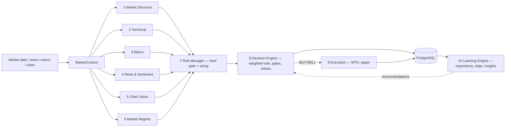

# GoldMind AI

**An institutional-grade, multi-agent AI trading system for XAUUSD (Gold).**

GoldMind is not a price predictor. It is a decision-support system that classifies
the *present* market into a small set of conditions and emits a sized,
risk-bounded trade proposal **only** when multiple independent signals align,
the regime is favorable, and the risk gate approves. The overwhelmingly common
output is `NO_TRADE` — and that is a first-class, correct decision. Target
profile: ~1–5 trades/day, low drawdown, prop-firm compatible, every decision
logged and explainable.

> ⚠️ Decision-support software, **not financial advice**. The bundled synthetic
> backtests validate plumbing only — they are **not** evidence of edge. Trade
> real capital only after walk-forward validation on real history and a shadow-mode
> trial. See [docs/07](./docs/07-backtesting.md).

---

## Why it's built this way

Three invariants shape every module:

1. **Capital preservation dominates** — a deterministic Risk Manager is a hard
   gate in front of execution; no analytical conviction can bypass a tripped
   circuit breaker or a news blackout.
2. **Explainability is non-negotiable** — every cycle records every agent's vote,
   confidence, reasoning, and risk flags, for trades *and* no-trades.
3. **Determinism where it matters** — structure, indicators, regime, sizing, and
   the event gate are pure functions of the data. LLMs are confined to roles
   where a wrong-but-plausible answer degrades *quality*, not *safety*, and always
   have a deterministic fallback.

## Architecture at a glance



Six analytical agents vote (weights: structure 25 · technical 20 · macro 20 ·
news 10 · vision 10 · regime 10 · risk 5). The Decision Engine combines them into
a net score, agreement, and a 0–100 quality score, and only trades when all gates
clear and no CRITICAL flag (news blackout, circuit breaker) vetoes. Full detail in
[docs/02](./docs/02-agents.md) and [docs/04](./docs/04-langgraph-workflow.md).

## Repository layout

```
src/goldmind/
  config.py            Validated 12-factor settings (risk limits, weights, models)
  logging.py llm.py    Structured logging; provider-agnostic LLM wrapper (+fallbacks)
  observability.py     Prometheus metrics (import-safe)
  cli.py               `goldmind` CLI (evaluate / backtest / graph / serve)
  core/                enums, schemas (Pydantic contracts), exceptions, MarketContext
  indicators/          Causal technical indicators (RSI/MACD/EMA/ATR/BB/ADX/swings)
  agents/              The 10 agents + registry
  graph/               LangGraph state + workflow (and the direct Orchestrator)
  data/                MT5 client (lazy, Windows-only)
  db/                  schema.sql, SQLAlchemy models, session, repository
  backtest/            engine, walk_forward, synthetic data, run CLI
  api/                 FastAPI control plane + serialization
tests/                 50+ unit/integration tests (offline)
dashboard/             Next.js 14 + TypeScript + Tailwind UI
deploy/                Prometheus + Grafana provisioning
docs/                  Full documentation suite (start at docs/README.md)
Dockerfile  docker-compose.yml  Makefile
```

## Quickstart (no API keys, DB, or broker required)

```bash
pip install -r requirements.txt

# One decision on synthetic data, fully explained:
PYTHONPATH=src python -m goldmind.cli evaluate

# A synthetic backtest (plumbing demo — not edge):
PYTHONPATH=src python -m goldmind.backtest.run --bars 8000

# Print the LangGraph workflow:
PYTHONPATH=src python -m goldmind.cli graph

# Run the API, then open http://localhost:8000/docs
PYTHONPATH=src uvicorn goldmind.api.main:app --port 8000
```

LLM agents (macro / news sentiment / vision) **degrade gracefully** to neutral,
low-confidence outputs when no `OPENAI_API_KEY` / `ANTHROPIC_API_KEY` is set — so
the system runs anywhere. Add keys (copy `.env.example` → `.env`) to enable them.

### Turn the LLM agents on

One key powers the whole suite. Put it in `.env` (leave the other blank):

```bash
cp .env.example .env
echo 'OPENAI_API_KEY=sk-...your-key...' >> .env      # or ANTHROPIC_API_KEY=sk-ant-...
```

The provider is chosen by **which key is set** — with only `OPENAI_API_KEY`, the
Claude-default roles transparently use `gpt-4o` / `gpt-4o-mini`; with only
`ANTHROPIC_API_KEY`, the vision role uses Claude. You don't edit model names.

The synthetic demo carries no macro/news/chart inputs, so the three LLM agents
have nothing to read by default. Feed them sample inputs (and a rendered chart for
Vision) with the `--llm` flag — it prints which provider each role resolved to:

```bash
PYTHONPATH=src python -m goldmind.cli evaluate --llm
```

In the dashboard, the **"AI agents: On"** toggle on the Overview does the same via
`POST /evaluate {"enrich_llm": true}`; each agent card then shows the model that
produced it (e.g. `gpt-4o`) and its latency.

> These sample inputs are demo wiring, not a live feed — real macro/news/price
> ingestion is roadmap milestone M1 ([docs/09](./docs/09-roadmap.md)). For the
> Vision agent on real charts, pass a screenshot path (`POST /evaluate
> {"screenshot_path": "..."}`); the demo renders one from the synthetic candles.

Full stack (API + Postgres + Prometheus + Grafana):

```bash
cp .env.example .env
docker compose up -d --build
docker compose --profile dashboard up -d   # + the Next.js UI on :3001
```

Common tasks are in the `Makefile` (`make test`, `make lint`, `make run-api`,
`make backtest`, `make graph`).

## Execution modes (safety)

Set via `GOLDMIND_EXECUTION_MODE`:

| Mode | Behavior |
|------|----------|
| `shadow` *(default)* | Analyze + log only. **No orders.** Safe everywhere. |
| `semi_auto` | Proposals require human approval (`POST /trades/{id}/approve`). |
| `full_auto` | Approved decisions route automatically (production + MT5 node). |

## Status

v0.1 foundation: all ten agents, LangGraph + Orchestrator, risk, backtest +
walk-forward, DB, API, dashboard, Docker, 50+ passing tests. **Not yet wired** to
live data feeds or validated on real history — that is the MVP path in
[docs/09](./docs/09-roadmap.md).

## Tech stack

Python 3.11 · LangGraph / LangChain (Claude reasoning, GPT-4o vision) · Pydantic v2
· FastAPI · SQLAlchemy 2 + PostgreSQL · pandas/numpy · MetaTrader5 (execution node)
· Prometheus + Grafana · Next.js 14 · Docker Compose.

## Documentation

Start at [`docs/README.md`](./docs/README.md): architecture, agents, database,
LangGraph workflow, API, risk framework, backtesting, deployment, and the roadmap.
