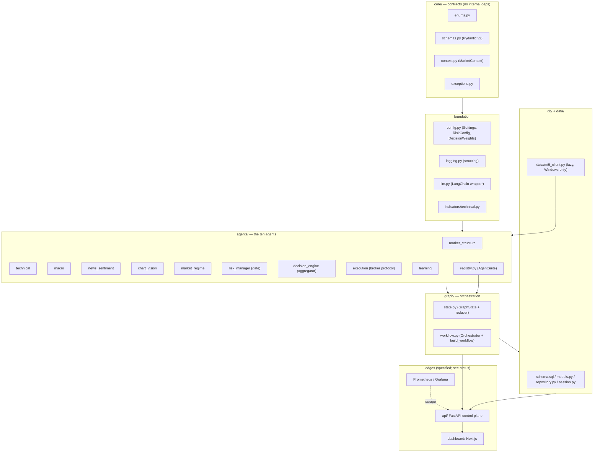
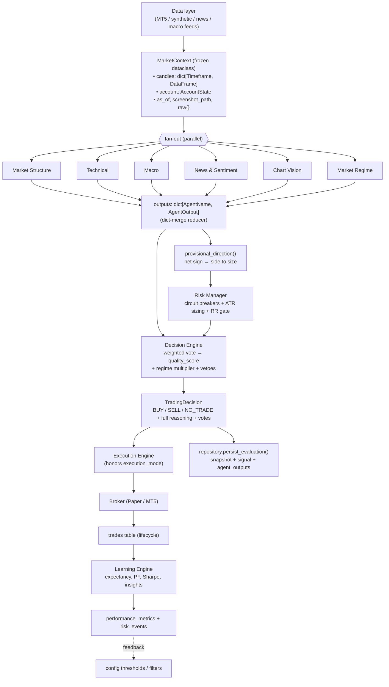

# 01 — System Architecture

> Part of the [GoldMind AI documentation suite](./README.md). See also:
> [Agents](./02-agents.md) ·
> [Database](./03-database.md) ·
> [LangGraph Workflow](./04-langgraph-workflow.md) ·
> [API](./05-api.md) ·
> [Risk Framework](./06-risk-framework.md) ·
> [Backtesting](./07-backtesting.md) ·
> [Deployment](./08-deployment.md) ·
> [Roadmap](./09-roadmap.md)

---

## 1. Purpose and philosophy

GoldMind AI is a multi-agent decision-support system for a single instrument:
spot gold, `XAUUSD`. The design goal is **not** to predict price. It is to
*classify the present* into a small set of conditions and, only when those
conditions are individually high-quality and mutually corroborating, to emit a
sized, risk-bounded trade proposal. The overwhelmingly common output is
`NO_TRADE`, and that is treated as a first-class, correct outcome rather than a
failure to act.

Three invariants follow from that philosophy and shape every module below:

1. **Capital preservation dominates.** A deterministic Risk Manager is a hard
   gate in front of execution. No amount of analytical conviction can bypass a
   tripped circuit breaker or a news blackout.
2. **Explainability is non-negotiable.** Every cycle records every agent's
   vote, confidence, reasoning, and risk flags — for both trades and no-trades.
   The system must be able to answer "why" after the fact, not just "what".
3. **Determinism where it matters.** The components that protect capital
   (structure detection, indicators, regime classification, sizing, the event
   gate) are pure functions of the input data. LLMs are confined to roles where
   a wrong-but-plausible answer degrades quality rather than breaching safety,
   and they always have a deterministic fallback.

The intended operating profile is roughly 1–5 trades per day, low drawdown, and
compatibility with proprietary-firm risk rules (FTMO / MyForexFunds-style daily
and total drawdown limits). See [Risk Framework](./06-risk-framework.md).

---

## 2. Component map

The package lives under `src/goldmind/`. The layering is deliberate: `core`
depends on nothing internal; agents depend on `core`, `config`, `indicators`,
and `llm`; the graph depends on agents; the persistence and API layers depend on
the graph's output types but never the reverse.



> **Status note.** `core`, `config`, `logging`, `llm`, `indicators`, all ten
> agents, `graph`, `db`, and `data/mt5_client` are implemented. The `api/`
> package, the Docker/observability infra, and the dashboard beyond its
> scaffold are *specified here and not yet present in the tree*. The
> [Roadmap](./09-roadmap.md) tracks this precisely; sections that describe
> not-yet-built surfaces are marked **(planned)**.

---

## 3. The ten agents at a glance

The system is "multi-agent" in the sense of role specialization, not autonomous
negotiation. Six agents are *directional voters*; one is a *gate*; one is an
*aggregator*; one *acts*; one *learns*. Their stable identifiers are the
`AgentName` enum (`core/enums.py`), which doubles as dict keys, DB values, and
dashboard labels.

| # | Agent | Role | Determinism | Decision weight |
|---|-------|------|-------------|-----------------|
| 1 | Market Structure (SMC) | Voter | Deterministic | 0.25 |
| 2 | Technical | Voter | Deterministic | 0.20 |
| 3 | Macro | Voter | LLM + rule fallback | 0.20 |
| 4 | News & Sentiment | Voter + hard event gate | LLM sentiment, deterministic gate | 0.10 |
| 5 | Chart Vision | Voter | Multimodal LLM | 0.10 |
| 6 | Market Regime | Voter + quality multiplier | Deterministic | 0.10 |
| 7 | Risk Manager | **Hard gate** + sizing | Deterministic | 0.05 (feasibility) |
| 8 | Decision Engine | Aggregator | Deterministic | — |
| 9 | Execution | Broker actions | Deterministic | — |
| 10 | Learning | Post-hoc analysis | Deterministic | — |

The weights live in `DecisionWeights` (`config.py`) and are validated to sum to
1.0. The six voter weights are renormalized to 1.0 by
`DecisionWeights.scoring_weights()`; the Risk Manager's 0.05 is *not* a
directional vote — it expresses how much execution feasibility informs the final
quality score, and in the current Decision Engine it is realized as an
approve/reject gate rather than an additive term (see
[§6](#6-design-decisions-and-alternatives)). Full per-agent specs are in
[Agents](./02-agents.md).

---

## 4. Data flow for one evaluation cycle

A cycle is the atomic unit of work: one `MarketContext` in, one
`TradingDecision` (plus all supporting outputs) out, optionally persisted and
optionally executed.



Walking the path:

1. **Feed → context.** The data layer assembles a `MarketContext`
   (`core/context.py`): a *frozen* dataclass holding per-timeframe OHLCV
   DataFrames, an `AccountState`, an `as_of` timestamp, an optional chart
   screenshot path, and a free-form `raw` dict for pre-fetched news/macro
   payloads. Heavy numeric series are kept here (not in the Pydantic schemas) so
   the contracts stay JSON-clean and cheap to serialize. `as_of` is the cycle's
   "now"; in backtests it is simulated bar time, and the data layer — not the
   agents — is responsible for never leaking future data.

2. **Fan-out.** The six analytical agents each receive the *same* immutable
   context and run independently. There is no inter-agent messaging; isolation
   is what makes the vote meaningful and the cycle reproducible. They run
   concurrently (LangGraph parallel nodes in production, a `ThreadPoolExecutor`
   in the direct `Orchestrator`).

3. **Fan-in.** Each agent returns an `AgentOutput` subclass. They merge into a
   single `outputs: dict[AgentName, AgentOutput]` via a dict-merge reducer (see
   [LangGraph Workflow](./04-langgraph-workflow.md)). Every output carries
   `bias`, `confidence ∈ [0,1]`, `reasoning`, `risk_flags`, an agent-specific
   `analysis` payload, and provenance (`model`, `latency_ms`, `error`).

4. **Provisional direction → risk.** Before the final decision, the Risk
   Manager needs a side in order to place a stop. `provisional_direction()`
   computes the weighted net sign of the voters; the Risk Manager then runs
   circuit breakers, computes ATR-anchored sizing, and applies the reward:risk
   floor — all deterministically.

5. **Decision.** The Decision Engine combines the votes into
   `net_directional_score`, `agreement`, and a 0–100 `quality_score`, scales the
   required quality by the regime's `quality_multiplier`, applies CRITICAL
   vetoes, and confirms the Risk Manager approved. It emits a `TradingDecision`
   recording every vote and gate outcome.

6. **Execution.** The Execution Engine honors `execution_mode`
   (`shadow` / `semi_auto` / `full_auto`) and routes through a `Broker` protocol
   (`PaperBroker` or `MT5Broker`). See [§5](#5-the-broker-abstraction).

7. **Persistence + learning.** `repository.persist_evaluation()` writes the
   snapshot, the signal, and one `agent_outputs` row per agent **for every
   cycle, trade or not** — selection bias would otherwise destroy the Learning
   Engine's condition analysis. Closed trades feed the Learning Engine, whose
   insights are designed to feed back into config thresholds and filters.

---

## 5. The broker abstraction

Execution is decoupled from any specific venue via a `Broker` `Protocol`
(`agents/execution.py`):

```python
@runtime_checkable
class Broker(Protocol):
    def place_order(self, req: OrderRequest, ref_price: float | None = None) -> OrderResult: ...
    def modify(self, ticket: int, stop_loss=None, take_profit=None) -> bool: ...
    def close(self, ticket: int, volume=None, ref_price=None) -> OrderResult: ...
    def positions(self) -> list[OpenPosition]: ...
```

Two consequences matter:

- The same `ExecutionEngine` drives a live MT5 account, an in-memory
  `PaperBroker` (shadow mode, dev, tests — deterministic fills with optional
  fixed slippage), and the backtester. There is exactly one trade-management
  code path (break-even, trailing, partials), so behavior is identical across
  environments.
- `MetaTrader5` is a Windows-only C-extension and is **lazy-imported**
  (`data/mt5_client.py`). The analytical core, the research environment, and CI
  install on Linux/macOS with no MT5 dependency; only the execution node needs
  the terminal. This is why MT5 lives in a separate `requirements-mt5.txt`.

---

## 6. Design decisions and alternatives

This section records *why* the architecture looks the way it does, and where a
future iteration could legitimately diverge.

### 6.1 Isolated voters vs. agent debate

**Decision.** Agents are stateless, mutually isolated pure-ish functions of one
context; aggregation is a transparent weighted vote in the Decision Engine.

**Rationale.** Independence is what makes "agreement" a meaningful signal. If
agents could see each other's conclusions (a debate / chain-of-agents pattern),
correlated errors and anchoring would inflate apparent agreement exactly when it
is least deserved, and the cycle would lose reproducibility. A fixed linear
combination is auditable and trivially backtestable.

**Alternative / upgrade.** A learned aggregator (logistic regression or gradient
boosting) over the per-agent features, trained on realized R, would likely beat
hand-set weights *once enough live trades exist to fit it honestly*. The
infrastructure already records every vote and outcome to support this. The risk
is overfitting on a short, regime-specific history — hence the current
hand-set, interpretable weights as the v1 default. See
[Roadmap](./09-roadmap.md).

### 6.2 Determinism budget — where LLMs are allowed

**Decision.** SMC structure, indicators, regime, sizing, and the news *event
gate* are deterministic. LLMs are used only for macro synthesis, news
*sentiment*, and chart vision — and each has a deterministic fallback.

**Rationale.** A trading system's failure modes are asymmetric: a confidently
wrong safety decision (e.g. "it's fine to trade into FOMC") is catastrophic,
while a slightly worse sentiment read merely lowers quality. We spend the
"LLM budget" only where the downside is bounded. The largest decision weight
(0.25) deliberately goes to the *most* deterministic, reproducible agent
(structure), not to an LLM.

**Alternative / upgrade.** Calibrate the LLM agents' confidence against realized
outcomes (reliability diagrams / temperature scaling) so a stated confidence of
0.8 actually wins ~80% of the time; today their confidence is heuristic.

### 6.3 Risk Manager as a gate, not a vote

**Decision.** The Risk Manager returns `approved: bool` plus sizing; it is a
hard gate, and its 0.05 "weight" does not enter the additive `net_directional_score`.

**Rationale.** Mixing feasibility into a directional score is a category error —
a perfectly sized trade is not "more bullish". Capital preservation must be able
to veto regardless of conviction, which an additive weight cannot guarantee.

**Alternative / upgrade.** If desired, feasibility could modulate *position
size* continuously (e.g. scale lots by a confidence-derived Kelly fraction)
rather than being purely binary at the gate. The schema already supports
arbitrary sizing; this is a sizing-policy change, not an architecture change.
See [Risk Framework §future](./06-risk-framework.md).

### 6.4 Two orchestrators (direct `Orchestrator` + LangGraph)

**Decision.** The same node functions back both a synchronous `Orchestrator`
(used by the backtester and tests) and a compiled LangGraph `StateGraph` (the
production runtime).

**Rationale.** Backtests run the cycle millions of times and want zero graph
overhead, no checkpointer, and easy stepping; production wants streaming,
checkpointing, retries, and a visual graph. Sharing the *logic* (`run_analytical`,
`run_risk`, `run_decision`) guarantees the two paths cannot diverge in behavior.
Full treatment in [LangGraph Workflow](./04-langgraph-workflow.md).

### 6.5 Fail-safe degradation over fail-fast

**Decision.** `BaseAgent.run()` catches every exception and returns a neutral,
zero-confidence output with a CRITICAL `agent_error` flag, rather than crashing
the graph. The Decision Engine treats ≥3 degraded agents as automatic
`NO_TRADE`.

**Rationale.** One flaky data source or LLM timeout must never (a) take down the
whole cycle or (b) be silently interpreted as a confident signal. "No
information here" is the safe interpretation, and it composes correctly with the
agreement/quality gates.

### 6.6 Single instrument, single position (for now)

**Decision.** `XAUUSD` only; `max_concurrent_positions = 1` by default.

**Rationale.** Gold is one liquid instrument with well-understood macro drivers
(real yields, DXY, risk sentiment); focusing the entire agent stack on it
maximizes signal quality and keeps risk accounting simple. Multi-instrument /
portfolio risk is an explicit later phase, not a retrofit
([Roadmap](./09-roadmap.md)).

---

## 7. Cross-references

- Per-agent contracts and methods → [Agents](./02-agents.md)
- The exact reducer and fan-out/fan-in semantics → [LangGraph Workflow](./04-langgraph-workflow.md)
- What gets stored and why → [Database](./03-database.md)
- Sizing math and circuit breakers → [Risk Framework](./06-risk-framework.md)
- Look-ahead avoidance and the synthetic-data caveat → [Backtesting](./07-backtesting.md)
- Runtime topology, secrets, monitoring → [Deployment](./08-deployment.md)
