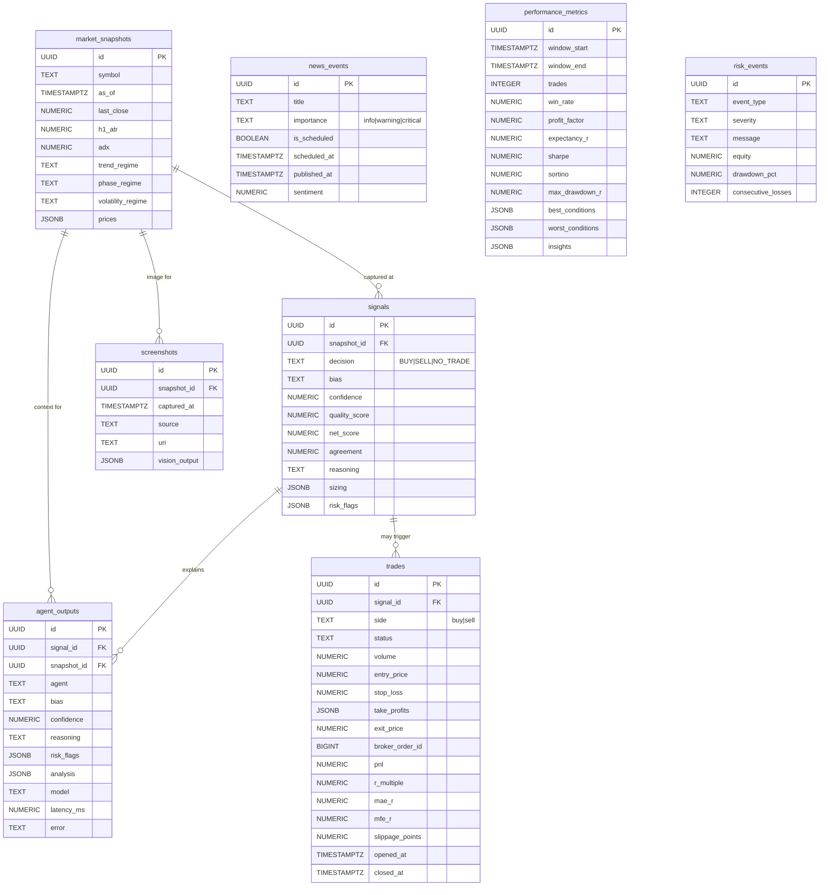

# 03 — Database

> Part of the [GoldMind AI documentation suite](./README.md). Prev:
> [Agents](./02-agents.md) · Next: [LangGraph Workflow](./04-langgraph-workflow.md).

The persistence layer is the system's memory and audit trail. The authoritative
DDL is `src/goldmind/db/schema.sql`; the SQLAlchemy 2.0 ORM in
`src/goldmind/db/models.py` is its typed mirror. The only code that maps domain
objects to rows is `src/goldmind/db/repository.py`, which keeps the agents and
orchestrator entirely persistence-agnostic (they can run with no database at
all).

---

## 1. Design principles

These are enforced consistently across the schema and explained inline in
`schema.sql`:

- **Every cycle is recorded, including no-trades.** Each evaluation writes a
  `market_snapshots` row, a `signals` row, and one `agent_outputs` row per agent
  — *even when the decision is `NO_TRADE`*. The Learning Engine needs the
  no-trades as much as the trades; analyzing only executed trades is a textbook
  selection bias that silently corrupts edge analysis.
- **Exact money.** Price and money columns are `NUMERIC` (e.g. `NUMERIC(14,4)`
  for prices, `NUMERIC(8,3)` for R), never floating point. Floats accumulate
  representation error that is unacceptable in P&L and risk accounting.
- **UTC everywhere.** All timestamps are `TIMESTAMPTZ`, storing UTC. There is no
  ambiguity about session boundaries or news timing.
- **Stable columns + flexible JSONB.** Fields that are queried, filtered, or
  aggregated are promoted to typed columns; the open-ended, agent-specific
  payloads (`analysis`, `sizing`, `risk_flags`, condition breakdowns, insights)
  live in `JSONB`. The schema stays stable while agents evolve their internal
  detail.
- **Portable ORM.** Models use `JSON().with_variant(JSONB(), "postgresql")` and
  `Uuid(as_uuid=True)`, so they are native JSONB/UUID on PostgreSQL in
  production yet importable and unit-testable against SQLite.

---

## 2. Entity-relationship diagram

`news_events`, `performance_metrics`, and `risk_events` are not foreign-keyed to
the cycle tables: they are independent ingestion/output logs (the economic
calendar, the Learning Engine's periodic reports, and the risk/alerting audit
stream respectively).

---

## 3. Table-by-table walkthrough

### `market_snapshots`
One row per evaluation cycle, capturing the market state the decision was made
against: `as_of`, `last_close`, `h1_atr`, `adx`, the three regime labels, and a
`prices` JSONB map of `{timeframe: close}`. This is the anchor the Learning
Engine joins to in order to attribute a trade's outcome to its regime. The full
OHLCV frames are deliberately **not** stored here — they belong to the data
layer / a market-data store; the snapshot keeps only the decision-relevant
scalars.

### `signals`
The Decision Engine's verdict for the cycle: `decision`
(`CHECK (decision IN ('BUY','SELL','NO_TRADE'))`), `bias`, `confidence`,
`quality_score`, `net_score`, `agreement`, the `reasoning` narrative, the
`sizing` snapshot (JSONB, present only when a trade was proposed), and the union
of `risk_flags`. Persisted by `repository.persist_evaluation()` for every cycle.

### `agent_outputs`
The explainability backbone: one row per agent per cycle (the six voters **plus**
the Risk Manager, which `persist_evaluation` adds explicitly since it is not in
the `outputs` map). Each row stores `bias`, `confidence`, `reasoning`, that
agent's `risk_flags`, its full `analysis` payload (the model dump minus
`risk_flags`), and provenance (`model`, `latency_ms`, `error`). This is what lets
anyone reconstruct exactly why a decision was made, months later. `ON DELETE
CASCADE` from `signals` keeps the trail tidy.

### `trades`
The execution ledger and the source of truth for learning. It follows the
lifecycle `proposed → pending → open → closed` (`status`), and records sizing
(`volume`, `entry_price`, `stop_loss`, `take_profits` JSONB), the realized
outcome (`exit_price`, `pnl`, `r_multiple`), execution quality
(`slippage_points`, `broker_order_id`), and excursion analytics (`mae_r`,
`mfe_r` — max adverse / favorable excursion in R). `r_multiple` is the column the
Learning Engine consumes. Repository helpers: `record_trade_proposed`,
`mark_trade_open`, `close_trade`.

### `screenshots`
Chart images fed to the Vision agent: `captured_at`, `source`
(`tradingview` / `mt5` / `upload`), the `uri` (path or object-store URL), and the
cached `vision_output` JSONB. Decoupling the image store from the snapshot keeps
binary blobs out of the relational hot path.

### `news_events`
The economic calendar and headline stream: `importance`
(`info` / `warning` / `critical`), `is_scheduled`, `scheduled_at` /
`published_at`, and a numeric `sentiment`. The News agent's deterministic
blackout reads scheduled CRITICAL events; indexing on `(importance,
scheduled_at)` makes "next high-impact event" cheap.

### `performance_metrics`
Periodic `PerformanceReport` snapshots from the Learning Engine — the headline
stats plus `best_conditions`, `worst_conditions`, and `insights` as JSONB. Stored
by `save_performance_report`.

### `risk_events`
An audit and alerting source for circuit-breaker trips and risk warnings:
`event_type`, `severity`, `message`, plus the `equity` / `drawdown_pct` /
`consecutive_losses` at the time. This table is the natural feed for Grafana
alerts (see [Deployment](./08-deployment.md)).

### View: `v_daily_performance`
A convenience rollup over closed trades: per UTC day, the trade count, win rate,
summed P&L, and average R. Cheap dashboard read without recomputing from the
ledger each time.

---

## 4. Indexing and rationale

| Index | Table / columns | Why |
|-------|-----------------|-----|
| `ix_snapshots_symbol_asof` | `market_snapshots (symbol, as_of DESC)` | "Most recent snapshots for this symbol" — the dominant lookup. |
| `ix_signals_created` | `signals (created_at DESC)` | Decision feed (newest first) for the API/dashboard. |
| `ix_signals_decision` | `signals (decision, created_at DESC)` | Filter the feed by BUY/SELL/NO_TRADE efficiently. |
| `ix_agent_outputs_signal` | `agent_outputs (signal_id)` | Pull all agents for one decision (the explainability view). |
| `ix_agent_outputs_agent` | `agent_outputs (agent, created_at DESC)` | Per-agent timelines (e.g. "show Macro's recent calls"). |
| `ix_trades_status` | `trades (status)` | Fetch active (`open`) positions for management. |
| `ix_trades_closed_at` | `trades (closed_at DESC)` | The Learning Engine's `fetch_closed_trades` ordering. |
| `ix_news_scheduled` | `news_events (scheduled_at)` | Upcoming-events scan for the blackout gate. |
| `ix_news_importance` | `news_events (importance, scheduled_at)` | "Next high-impact event" directly. |
| `ix_risk_events_created` | `risk_events (created_at DESC)` | Recent risk-event stream for alerting. |

The pattern is consistent: index the columns that drive the read-time access
patterns (recency feeds, status filters, per-agent and per-decision joins,
calendar scans), and lean on JSONB for everything that is displayed but not
filtered.

---

## 5. Sessions, transactions, and bootstrap

`db/session.py` provides:

- `get_engine()` / `get_sessionmaker()` — memoized; the engine uses
  `pool_pre_ping=True` so long-lived VPS processes don't fail on stale
  connections.
- `session_scope()` — a context manager that commits on success, rolls back on
  any exception, and always closes. All repository writes should run inside it.
- `create_all()` — creates tables from ORM metadata for dev/test convenience;
  **production uses `schema.sql` (or Alembic migrations)**, which is the
  authoritative source and carries the `CHECK` constraints, the view, and the
  `pgcrypto` extension for `gen_random_uuid()`.

`make db-schema` prints the packaged `schema.sql`.

---

## 6. Retention and growth notes

- **No-trade volume.** Recording every cycle means the row count is driven by the
  *evaluation cadence*, not the trade count. At, say, one cycle per minute, that
  is ~1,440 snapshots + signals + ~10× `agent_outputs` per day. `agent_outputs`
  is by far the largest table.
- **Retention policy (recommended).** Keep `trades`, `performance_metrics`, and
  `signals` indefinitely (they are the learning substrate and are small). Apply a
  rolling retention to `agent_outputs` and `market_snapshots` (e.g. keep raw rows
  90–180 days, then down-sample or archive to cold storage). PostgreSQL native
  partitioning by month on `created_at` for `agent_outputs` / `market_snapshots`
  makes pruning a partition drop rather than a mass `DELETE`.
- **Screenshots.** Store the image bytes in object storage and keep only the
  `uri` + cached `vision_output` in the row to bound table size.
- **Append-mostly.** Nothing here is updated heavily except `trades` (status
  transitions); the workload is append-and-read, which keeps autovacuum pressure
  low and indexes healthy.

Next: [LangGraph Workflow](./04-langgraph-workflow.md).
