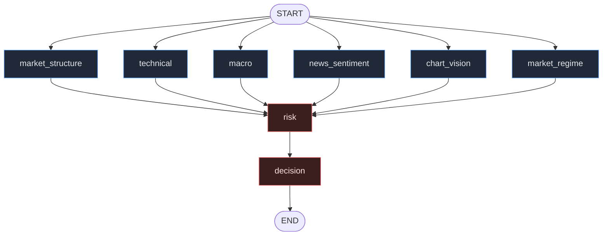

# 04 — LangGraph Workflow & Orchestration

> Part of the [GoldMind AI documentation suite](./README.md). Prev:
> [Database](./03-database.md) · Next: [API](./05-api.md).

Orchestration lives in `src/goldmind/graph/`. There are two ways to run one
evaluation cycle, both built from the *same* node functions:

- **`Orchestrator`** — a direct, synchronous pipeline (`graph/workflow.py`).
- **`build_workflow()`** — a compiled LangGraph `StateGraph` (`graph/workflow.py`),
  with state defined in `graph/state.py`.

This document covers the state schema and its reducer, the fan-out/fan-in
semantics, and why both entry points exist.

---

## 1. The graph

```
START ─▶ [market_structure, technical, macro, news_sentiment, chart_vision, market_regime]
      ─▶ (fan-in: outputs map) ─▶ risk ─▶ decision ─▶ END
```



Each of the six analytical nodes has an edge `START → node` and an edge
`node → risk`. Because all six point at `risk`, LangGraph runs them in parallel
and only proceeds to `risk` once **all** have completed (the standard barrier
join). `risk → decision → END` is a simple sequential tail.

`make graph` (or `python -m goldmind.graph.workflow --print-mermaid`) prints the
live mermaid for the compiled graph, with a static fallback if the installed
LangGraph version cannot render.

---

## 2. State schema and reducers

`graph/state.py` defines the shared state as a `TypedDict`:

```python
class GraphState(TypedDict, total=False):
    ctx: MarketContext                                            # input
    outputs: Annotated[dict[AgentName, AgentOutput], merge_outputs]  # fan-in
    regime: MarketRegimeOutput                                    # single-writer
    risk: RiskAssessment                                          # single-writer
    decision: TradingDecision                                     # single-writer
```

The critical detail is the **reducer** on `outputs`. In LangGraph, when multiple
nodes write the *same* state key concurrently, the framework needs a function to
merge those writes; without one, concurrent updates to a key conflict. Here the
six analytical nodes each return `{"outputs": {self.name: output}}`, and the
reducer combines them:

```python
def merge_outputs(left, right) -> dict[AgentName, AgentOutput]:
    return {**(left or {}), **(right or {})}
```

This is a shallow dict-merge: each node contributes exactly one key (its own
`AgentName`), so there is never a real key collision — the reducer simply
accumulates the six partial maps into one `dict[AgentName, AgentOutput]`. The
`Annotated[..., merge_outputs]` is how LangGraph is told to use it.

Every other key (`ctx`, `regime`, `risk`, `decision`) is written by exactly one
node, so it uses default last-value-wins semantics and needs no reducer.

### Why a dict-merge and not a list-append

A list-append reducer would also "work" but loses the by-name addressing the rest
of the system relies on (`outputs[AgentName.MARKET_REGIME]`, the Decision
Engine's per-agent weighting, the Risk Manager's provisional direction). The
keyed map makes downstream code order-independent and self-documenting. It is
also idempotent under retries: re-running a node overwrites its own key rather
than duplicating an entry.

---

## 3. Fan-out / fan-in semantics in detail

**Fan-out.** `build_workflow()` adds one node per analytical agent and wires
`START → node`. The node closure captures its agent and runs it:

```python
def make_analytical_node(agent):
    def _node(state: GraphState) -> dict:
        return {"outputs": {agent.name: agent.run(state["ctx"])}}
    return _node
```

All six receive the same immutable `ctx`. They never see each other's results —
[isolation is what makes "agreement" meaningful](./01-architecture.md#61-isolated-voters-vs-agent-debate).

**Fan-in / barrier.** Every analytical node has an edge to `risk`, so `risk` is a
join point: LangGraph waits for all six, applies `merge_outputs`, and only then
invokes `risk_node`. By that point `state["outputs"]` holds all available agent
outputs.

```python
def risk_node(state):
    outputs = state["outputs"]
    risk = run_risk(suite, state["ctx"], outputs)      # provisional dir → sizing
    regime = outputs.get(AgentName.MARKET_REGIME)
    return {"risk": risk, "regime": regime}

def decision_node(state):
    return {"decision": run_decision(suite, state["ctx"], state["outputs"], state["risk"])}
```

Note that `risk_node` also lifts the regime output into the top-level `regime`
key so the Decision Engine can read the `quality_multiplier` without re-searching
the map.

**Shared logic.** The three `run_*` functions are module-level and shared with
the direct `Orchestrator`:

- `run_analytical(suite, ctx, concurrent=True)` — runs the six agents (in a
  `ThreadPoolExecutor` for the direct path; LangGraph parallelizes them in the
  graph path).
- `run_risk(suite, ctx, outputs)` — computes `provisional_direction()` from the
  votes, derives a reference entry and ATR (`_reference_entry_atr`: lowest
  available TF close for entry, H1 ATR preferred), and calls
  `RiskManager.assess()`.
- `run_decision(suite, ctx, outputs, risk)` — extracts the regime output and
  calls `DecisionEngine.decide()`.

Because both entry points call these identical functions, the graph and the
direct pipeline cannot diverge in behavior — only in their execution machinery.

---

## 4. The direct `Orchestrator`

```python
class Orchestrator:
    def evaluate(self, ctx, *, concurrent=True) -> EvaluationResult:
        ctx.validate()
        outputs  = run_analytical(self.suite, ctx, concurrent=concurrent)
        risk     = run_risk(self.suite, ctx, outputs)
        decision = run_decision(self.suite, ctx, outputs, risk)
        regime   = outputs.get(AgentName.MARKET_REGIME)
        return EvaluationResult(ctx, outputs, regime, risk, decision)
```

`EvaluationResult` is the unit the persistence layer stores (`ctx`, `outputs`,
`regime`, `risk`, `decision`), and it exposes `reference_atr` (derived back from
the sized stop distance) for the snapshot row.

---

## 5. Why both a graph and a direct orchestrator exist

This is a deliberate design decision (also summarized in
[Architecture §6.4](./01-architecture.md#64-two-orchestrators-direct-orchestrator--langgraph)):

| Concern | Direct `Orchestrator` | LangGraph `build_workflow()` |
|---------|-----------------------|------------------------------|
| Primary user | Backtester, walk-forward, unit tests | Production runtime / live loop |
| Overhead | Minimal — a function call + a thread pool | Graph executor, state plumbing |
| Throughput | Runs the cycle millions of times cheaply | Per-cycle, with framework features |
| Streaming / events | No | Yes (token/step streaming) |
| Checkpointing / resume | No | Yes (LangGraph checkpointer) |
| Retries / durability | Caller's responsibility | Built into the graph |
| Visualization | — | `get_graph().draw_mermaid()` |
| Stepping / debugging | Trivial (plain Python) | Via graph tooling |

The backtester cannot afford LangGraph's per-invocation overhead when sweeping
thousands of bars across many parameter sets, and it benefits from being plain,
synchronous, easy-to-step Python. Production, conversely, wants streaming,
checkpointing, retries, and a visual graph "for free". Sharing the node *logic*
(the `run_*` functions) is what makes maintaining two runners safe: a behavior
change lands in one place and both paths inherit it. If the two ever drifted, the
backtest would stop being a faithful simulation of production — the shared
functions structurally prevent that.

---

## 6. LangGraph version considerations

- The framework import is **lazy** (`from langgraph.graph import ...` inside
  `build_workflow`) so the core package imports without LangGraph installed —
  the analytical core, backtester, and tests don't need it.
- The Mermaid printer wraps `draw_mermaid()` in a try/except with a static
  fallback, because the rendering API has changed across LangGraph releases;
  `make graph` therefore always yields a usable diagram.
- Concurrency in the direct path is bounded by `max_workers=len(agents)` (six),
  which is appropriate because the agents are I/O-bound (LLM calls) or fast
  vectorized numpy.

Next: [API](./05-api.md).
