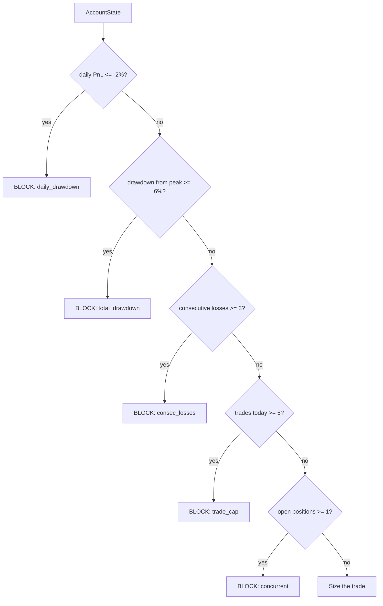

# 06 — Risk Management Framework

> Part of the [GoldMind AI documentation suite](./README.md). See also:
> [Architecture](./01-architecture.md) ·
> [Agents](./02-agents.md) ·
> [Database](./03-database.md) ·
> [LangGraph Workflow](./04-langgraph-workflow.md) ·
> [API](./05-api.md) ·
> [Backtesting](./07-backtesting.md) ·
> [Deployment](./08-deployment.md) ·
> [Roadmap](./09-roadmap.md)

---

## 1. Why risk is the spine, not a feature

The system's first job is to *not lose the account*. The Risk Manager
(`goldmind.agents.risk_manager.RiskManager`) is therefore a **deterministic hard
gate** placed between analysis and execution: no amount of analytical conviction
can bypass a tripped circuit breaker, an over-budget stop, or a sub-threshold
reward:risk. It is not a directional voter — it answers a single question: *given
the account state and a proposed direction, is there a safe, correctly-sized way
to express this trade, and is it even allowed right now?*

All limits live in one validated place (`goldmind.config.RiskConfig`) and fail
loudly at startup if inconsistent (e.g. daily DD ≥ total DD).

## 2. Limits (defaults)

| Parameter | Default | Meaning |
|-----------|---------|---------|
| `max_risk_per_trade` | 0.5% | Fraction of equity risked to the stop on any single trade |
| `max_daily_drawdown` | 2% | Daily loss that trips the circuit breaker (flat for the day) |
| `max_total_drawdown` | 6% | Account-level stop (prop-firm style) |
| `max_consecutive_losses` | 3 | Cool-off trigger after a losing streak |
| `max_trades_per_day` | 5 | Quality-over-quantity cap (target 1–5/day) |
| `max_concurrent_positions` | 1 | One gold position at a time by default |
| `min_reward_risk` | 1.8 | Reject setups whose blended RR is below this |
| `default_atr_stop_mult` | 1.5 | Stop distance = mult × ATR (volatility-adaptive) |
| `tp_r_multiples` / `tp_partials` | [1.5, 2.5, 4.0] / [0.5, 0.3, 0.2] | Partial take-profit ladder |
| `break_even_at_r` | 1.0 | Move stop to entry after +1R |
| `trailing_atr_mult` | 2.0 | Trailing-stop distance once trailing engages |

All are environment-overridable (`GOLDMIND_RISK__MAX_RISK_PER_TRADE=...`).

## 3. Position sizing math

Gold (XAUUSD) on a typical MT5 broker: **1.00 lot = 100 oz**, so a \$1 move is
\$100 per lot. Sizing is fixed-fractional and anchored to volatility via ATR:

```
stop_distance = default_atr_stop_mult × ATR(H1)
risk_amount   = equity × max_risk_per_trade
lot_size      = floor( risk_amount / (stop_distance × 100) , 0.01 )       # floored to broker step
actual_risk   = lot_size × stop_distance × 100                            # after flooring
take_profit_i = entry ± stop_distance × tp_r_multiples[i]                 # sign by side
blended_RR    = Σ tp_partials[i] × tp_r_multiples[i]
break_even    = entry ± stop_distance × break_even_at_r
trailing_dist = trailing_atr_mult × ATR
```

### Worked example

Equity \$100,000, ATR(H1) = \$5.00, long entry at \$2,350.00:

- `stop_distance = 1.5 × 5.00 = 7.50` → stop at `2342.50`
- `risk_amount = 100,000 × 0.005 = $500`
- `lot_size = floor(500 / (7.50 × 100), 0.01) = floor(0.666…) = 0.66`
- `actual_risk = 0.66 × 7.50 × 100 = $495` (0.495% — just under budget after flooring)
- TPs: `2350 + 7.5×1.5 = 2361.25` (close 50%), `2350 + 7.5×2.5 = 2368.75` (30%), `2350 + 7.5×4.0 = 2380.00` (20%)
- `blended_RR = 0.5×1.5 + 0.3×2.5 + 0.2×4.0 = 2.30` ≥ 1.8 → passes the RR gate
- `break_even = 2350 + 7.5×1.0 = 2357.50`; `trailing_dist = 2.0 × 5.00 = 10.00`

**Rejections** the sizer can return: stop so wide that even the minimum 0.01 lot
exceeds the risk budget (`stop_too_wide`), or blended RR below `min_reward_risk`
(`low_reward_risk`). Both yield `approved = false` → the Decision Engine emits
`NO_TRADE`.

## 4. Circuit breakers

Evaluated every cycle from the live `AccountState`. Any breach blocks new risk:



A soft early-warning flag (`approaching_daily_dd`) is raised at 60% of the daily
limit. Breaker trips are written to the `risk_events` table and surfaced as
Prometheus `goldmind_circuit_breaker_trips_total`. A tripped breaker also emits a
CRITICAL `circuit_breaker` flag, which the Decision Engine treats as a hard veto.

## 5. Prop-firm compatibility

The defaults map directly onto FTMO / MyForexFunds-style rule sets:

| Prop rule | GoldMind control |
|-----------|------------------|
| Max daily loss (e.g. 5%) | `max_daily_drawdown` (default 2% — deliberately tighter) |
| Max overall loss (e.g. 10%) | `max_total_drawdown` (default 6%) |
| Consistency / no over-leverage | `max_risk_per_trade` 0.5%, single position |
| No trading around news (some firms) | deterministic news blackout (Agent 4) |

Set the limits *below* the firm's hard thresholds to leave headroom for slippage
and open-position float — the breaker uses realized daily PnL, so a buffer
protects against an adverse move on the open trade.

## 6. Trade management

Handled by the Execution Engine's `manage()` (broker-agnostic):

- **Break-even**: once price reaches `break_even_at_r` in favor, the stop is
  moved to entry (locks out a full-stop loss).
- **Trailing**: beyond break-even, the stop trails price by `trailing_dist`,
  only ever tightening.
- **Partial take-profits**: the ladder closes `tp_partials` of the position at
  each R multiple; the backtester models this exactly.

## 7. Design decisions & better alternatives

- **Fixed-fractional vs. volatility targeting.** We size by a fixed fraction with
  an ATR-anchored stop — simple, robust, and prop-compatible. A natural upgrade is
  full **volatility targeting** (size to a target portfolio σ) or **fractional
  Kelly** scaled by the Learning Engine's measured edge per regime. Kelly is
  powerful but fragile to estimation error; a capped fractional-Kelly (≤ 0.25)
  gated by minimum sample size is the recommended evolution.
- **Static vs. adaptive limits.** Limits are static today. The Learning Engine
  already surfaces regimes/sessions with negative expectancy; a closed loop could
  *automatically* tighten `min_quality` or reduce size in those buckets.
- **Correlation.** Single-instrument today, so portfolio correlation is moot. If
  silver/DXY/related instruments are added, sizing must become correlation-aware
  to avoid stacking the same macro bet.
