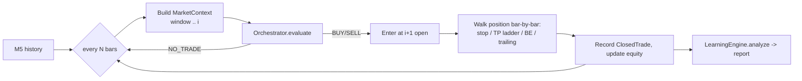
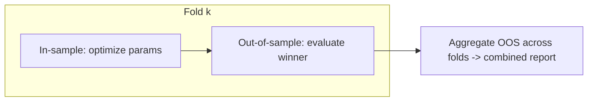

# 07 — Backtesting & Walk-Forward

> Part of the [GoldMind AI documentation suite](./README.md). See also:
> [Architecture](./01-architecture.md) ·
> [Agents](./02-agents.md) ·
> [Database](./03-database.md) ·
> [LangGraph Workflow](./04-langgraph-workflow.md) ·
> [API](./05-api.md) ·
> [Risk Framework](./06-risk-framework.md) ·
> [Deployment](./08-deployment.md) ·
> [Roadmap](./09-roadmap.md)

---

## 1. Principle: backtest the real system

The backtester (`goldmind.backtest.engine.BacktestEngine`) drives the **same
`Orchestrator`** used live — the identical agents, risk gate, and decision logic.
We never re-implement strategy logic for testing; we replay history through the
production decision path. That eliminates the most common source of backtest/live
divergence.

## 2. No look-ahead, by construction

Three guarantees keep results honest:

1. **Causal indicators.** Every indicator in `goldmind.indicators.technical` is a
   causal function of past/closed bars (Wilder smoothing, rolling windows). Swing
   points are *confirmed* fractals: the most recent `right` bars can never be
   swings, so structure never repaints.
2. **Decision-then-next-bar entry.** A decision computed on bar *i* (its last
   closed bar) is entered at **bar *i+1*'s open**, never at the signal bar's
   close.
3. **Windowed context.** Each evaluation builds a `MarketContext` from a trailing
   window up to bar *i* and resamples M5 → M15/H1/H4 exactly as the live feed
   would aggregate.

## 3. The simulation loop



### Fill model (deliberately pessimistic)

- Entry, stop and TPs are charged half the spread + half the slippage.
- If a single bar's range touches **both** the stop and a take-profit, the **stop
  is assumed to fill first**. This biases results *down* — the safe direction for
  a risk-first system.
- Round-trip costs (spread + slippage) are deducted in R units per trade.

### The risk gates are live in the sim

Equity, peak equity, consecutive losses and trades-per-day are tracked and fed
back into the `AccountState` each cycle, so the **circuit breakers fire in the
backtest exactly as they would live**. A backtest that hits the daily DD limit
goes flat for that simulated day, just like production.

## 4. Metrics

`LearningEngine.analyze()` produces, in R units (risk-normalized, the only unit
that composes across position sizes):

- Win rate, profit factor (None/∞ when there are no losses), expectancy (R)
- Per-trade Sharpe and Sortino
- Max drawdown (R and, from the equity curve, %)
- Average win/loss (R)
- Best/worst **conditions** (by regime, session, agreement bucket)
- Actionable **insights** (tighten filters, raise the agreement gate, widen the
  news blackout, edge-decay detection)

## 5. Walk-forward analysis

Single-pass backtests overfit — you tune and report on the same data.
`WalkForwardAnalysis` instead repeatedly:

1. **optimizes** parameters on an in-sample (IS) window (grid over the Decision
   Engine `min_quality` gate and the Risk Manager `atr_stop_mult`), then
2. **evaluates** the winning parameters on the immediately following,
   untouched out-of-sample (OOS) window.

Only the concatenated **OOS** trades are reported — the honest estimate of
forward performance. The harness is generic: pass any parameter grid and a
factory that maps a parameter dict to an `Orchestrator`.



## 6. Running it

```bash
# Synthetic (plumbing validation only)
python -m goldmind.backtest.run --bars 8000 --drift 0.0001
python -m goldmind.backtest.run --walk-forward --bars 16000

# Real history (M5 CSV: time,open,high,low,close,volume — UTC)
python -m goldmind.backtest.run --csv data/raw/xauusd_m5.csv
python -m goldmind.backtest.run --csv data/raw/xauusd_m5.csv --walk-forward
```

## 7. The synthetic-data caveat

The bundled generator produces Gaussian random walks (trending via drift) or an
Ornstein-Uhlenbeck process (ranging). It exists to validate **plumbing** —
that the whole pipeline runs end to end with no external dependencies — and to
make tests deterministic. **Synthetic results are not evidence of edge.** A
trend-follower trivially "wins" on a drifted random walk. Only walk-forward
results on real XAUUSD history, net of realistic costs, mean anything.

## 8. Design decisions & better alternatives

- **Bar-level vs. tick-level fills.** We simulate on bars with a pessimistic
  intrabar rule. Tick or 1-minute sub-sampling would sharpen stop/TP ordering and
  slippage realism — the recommended next step before sizing up capital.
- **Grid search vs. smarter optimization.** Walk-forward uses a small grid.
  Bayesian optimization or CPCV (combinatorial purged cross-validation, López de
  Prado) would give better-calibrated OOS estimates and de-bias parameter choice.
- **Single path vs. Monte Carlo.** Report distributions (bootstrap the trade
  sequence) rather than a single equity path, to quantify drawdown risk and the
  probability of ruin under the configured limits.
- **Execution realism.** Add latency, partial fills, and a spread model that
  widens around the news blackout windows the system already detects.
