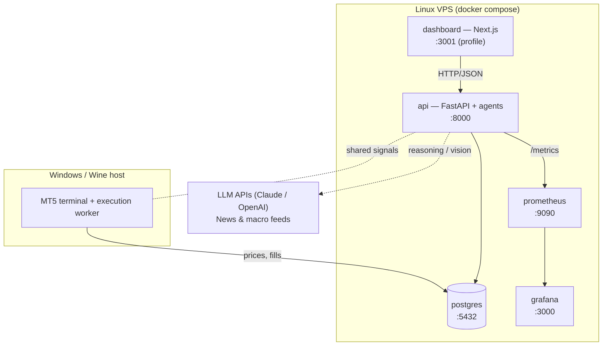

# 08 — Deployment, Monitoring & Operations

> Part of the [GoldMind AI documentation suite](./README.md). See also:
> [Architecture](./01-architecture.md) ·
> [Agents](./02-agents.md) ·
> [Database](./03-database.md) ·
> [LangGraph Workflow](./04-langgraph-workflow.md) ·
> [API](./05-api.md) ·
> [Risk Framework](./06-risk-framework.md) ·
> [Backtesting](./07-backtesting.md) ·
> [Roadmap](./09-roadmap.md)

---

## 1. Topology

The analysis/control plane is OS-agnostic and containerized. The **execution
node is separate** because `MetaTrader5` is a Windows-only library — it runs on a
Windows (or Wine) host and connects to the shared Postgres and API over the
private network.



## 2. The compose stack

`docker-compose.yml` brings up:

| Service | Image / build | Port | Role |
|---------|---------------|------|------|
| `postgres` | postgres:16-alpine | 5432 | State; `schema.sql` auto-applied on first boot |
| `api` | `Dockerfile` (this repo) | 8000 | Agents + Orchestrator + control-plane API |
| `prometheus` | prom/prometheus | 9090 | Scrapes `api:8000/metrics` |
| `grafana` | grafana/grafana | 3000 | Dashboards (provisioned from `deploy/grafana`) |
| `dashboard` | `./dashboard` | 3001 | Next.js UI (behind the `dashboard` compose profile) |

```bash
cp .env.example .env            # fill secrets
docker compose up -d --build    # api + postgres + prometheus + grafana
docker compose --profile dashboard up -d   # also the UI
```

The `api` image is Linux-only and intentionally **excludes** MetaTrader5 (see
`requirements-mt5.txt`); it runs every agent including the deterministic core and
the LLM agents.

## 3. The execution node (Windows / Wine)

1. Install Python + `pip install -r requirements.txt -r requirements-mt5.txt`.
2. Configure `MT5_LOGIN/PASSWORD/SERVER/TERMINAL_PATH` in `.env`.
3. Run the execution worker, which connects via `goldmind.data.mt5_client`,
   pulls live candles/account state, and — in `semi_auto`/`full_auto` — routes
   approved decisions and manages open positions (break-even, trailing, partials).

Execution is always gated by `GOLDMIND_EXECUTION_MODE`:

- `shadow` — analyze + log only; **no orders** (default; safe to run anywhere).
- `semi_auto` — proposals require human approval (`POST /trades/{id}/approve`).
- `full_auto` — approved decisions route automatically (prod only).

## 4. Configuration & secrets

- All config flows through `goldmind.config.Settings` (12-factor; validated at
  boot). Secrets come from the environment / `.env`, never code.
- In production, source secrets from a manager (Docker secrets, Vault, SSM) and
  mount them as env vars. Restrict CORS on the API to the dashboard origin
  (the default `*` is for local development).
- The container runs as a non-root user; Postgres data and Grafana state are on
  named volumes.

## 5. Monitoring & alerting

`goldmind.observability` exposes Prometheus metrics (import-safe — no-ops if the
client is absent):

| Metric | Type | Use |
|--------|------|-----|
| `goldmind_evaluations_total{decision}` | counter | Decision mix (BUY/SELL/NO_TRADE) |
| `goldmind_decision_quality` | histogram | Setup quality distribution |
| `goldmind_agent_latency_seconds{agent}` | histogram | Per-agent latency (LLM watch) |
| `goldmind_account_equity` / `_drawdown_pct` | gauge | Live capital + drawdown |
| `goldmind_circuit_breaker_trips_total{rule}` | counter | Safety events |
| `goldmind_trades_total{side,outcome}` | counter | Realized outcomes |

A provisioned Grafana dashboard (`deploy/grafana/.../goldmind.json`) renders
equity, drawdown (with thresholds at the daily/total limits), decision mix, agent
latency p95, and breaker trips. **Recommended alerts:** drawdown gauge crossing
60% of the daily limit; any circuit-breaker trip; agent latency p95 above SLA
(LLM provider degradation); evaluation rate dropping to zero (feed/worker down).

## 6. Reliability notes

- LLM calls retry with exponential backoff (`tenacity`) and **degrade to neutral,
  low-confidence outputs** on failure — a provider outage reduces information, it
  never breaches safety or crashes the graph.
- `pool_pre_ping` guards against stale DB connections on long-lived processes.
- The Orchestrator catches per-agent failures and records them as CRITICAL flags;
  three or more degraded agents force `NO_TRADE`.

## 7. Design decisions & better alternatives

- **Compose vs. Kubernetes.** Compose on a single VPS is right for one
  instrument and one execution node. Move to k8s only when you need HA control
  planes or many workers; the stateless `api` scales horizontally already.
- **DB migrations.** `schema.sql` + `Base.metadata.create_all` suffice for v0.1;
  adopt **Alembic** before the first production schema change.
- **MT5 isolation.** Keep the Windows execution node minimal and firewalled;
  treat it as the only component allowed to place orders, with its own kill
  switch independent of the API.
